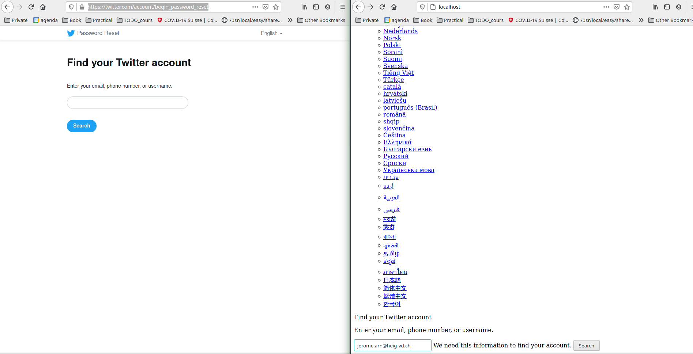

# The Social-Engineer Toolkit (SET)

## Introduction

Selon la propre description donnée par [TrustedSec, LLC](https://www.trustedsec.com), la société de consulting américaine responsable du développement de ce produit, le [Social-Engineer Toolkit](https://github.com/trustedsec/social-engineer-toolkit/) est un framework de test d'intrusion open-source conçu pour l'ingénierie sociale. Le SET dispose d'un certain nombre de vecteurs d'attaque personnalisés qui vous permettent de réaliser rapidement une attaque crédible.

Le SET est spécifiquement conçu pour réaliser des attaques avancées contre l'élément humain. Il est rapidement devenu un outil standard dans l'arsenal des testeurs de pénétration. Les attaques intégrées dans la boîte à outils sont conçues pour être des attaques ciblées contre une personne ou une organisation utilisées lors d'un test de pénétration.


## Téléchargement et installation

Le SET est nativement supporté sur Linux et sur Mac OS X (experimental). Il est préinstallé sur Kali Linux et il est capable de se mettre à jour lui-même.

Pour une installation sur Ubuntu/Debian/Mac OS X :

```
git clone https://github.com/trustedsec/social-engineer-toolkit/ setoolkit/
cd setoolkit
pip3 install -r requirements.txt
python setup.py
```

## Que faut-il faire ?

Voici les activités à réalise dans ce laboratoire. Vous devez : 

- Installer le Social Engineering Toolkit (SET)
- Créer un collecteur d'identifiants (credential harvester)
- Capturer certains identifiants utilisateur (les vôtres)
- Créer une attaque de phishing
- Relier le collecteur d'identifiants à l'attaque

Le "rapport" de ce labo est très simple : **Pour chaque tâche, faites des captures d'écran de vos activités**.

## Note sur l'éthique

Il n'est absolument pas acceptable d'attaquer quelqu'un pour quelque raison que ce soit. 

L'utilisation de cet outil à des fins autres que votre propre éducation et formation sans autorisation est strictement interdite par les politiques de ce cours et de l'école, ainsi que par les lois. 

Le but de cet exercice est de vous permettre de vous familiariser avec les outils et comment ils peuvent être utilisés dans le contexte professionnel d'un pentest. Ça vous permettra aussi de comprendre les tactiques de l'adversaire afin de pouvoir les contrer par le biais de la politique, de l'éducation et de la formation.

## Execution de SET

Pour exécuter SET, dans votre terminal taper :

```
setoolkit
```

Dépendant de votre OS et de votre installation particulière, il est possible que certaines fonctionnalités ne soient pas disponibles au moins d'utiliser ```sudo```.

```
sudo setoolkit
```

# Exercice 1 - Credential Harvesting

Vous découvrirez l'un des outils les plus couramment utilisés par les ingénieurs sociaux et les acteurs malveillants pour tromper les cibles.

### Soumettre des captures d'écran

Pour le collecteur d'identifiants, montrez que vous avez cloné un site en indiquant son adresse web et l'interface d'utilisateur. Saisissez les informations d'identification sur votre clone local, puis cliquez le bouton de connexion. Essayez plusieurs sites comme facebook.com, twitter.com, et d'autres qui puissent vous intéresser. Faites des captures d'écran des mots de passe collectés dans vos tests avec SET.

### Test - linkedin

Dans ce cas, j'ai pu copié le site de manière approximative et ainsi obtenir les identifiants voulu. Mais la partie apparence est très loin du modèle


### Test - github

La copie du site est en tout point pareil à son modèle et à permis d'obtenir les identifants voulus.


### Test - webmail heig

Même si la copie est parfaite, elle n'est pas fonctionnelle. en cliquant sur **sign in** la page produit une erreur et ne capture pas les identifiants rentrés par l'utilisateurs.


### Test - twitter 

Ici une protection, volontaire ou non, n'as pas permis de copier la page de login. Une erreur s'affichait à chaque fois. J'ai essayé de copier la page **oubli de mot de passe**, On peut cette fois copier la page pour retrouver son compte. Même si l'apparence est loin du modèle, elle est tout de même fonctionnelle.




# Exercice 2 - Créer une attaque de phishing

Essayez la fonction d'attaque par phishing. C'est très facile à faire. Vous pouvez vous référer à ce lien pour plus d'informations http://www.computerweekly.com/tutorial/Social-Engineer-Toolkit-SET-tutorial-for-penetration-testers


# Exercice 3 - Explorer les liens "Phishy" et le courrier électronique "Phishy"

Pour cette dernière partie de notre exploration du phishing, nous allons utiliser un contenu réalisé par les  Dr. Matthew L. Hale, le Dr. Robin Gandhi et la Dr. Briana B. Morrison de [Nebraska GenCyber](
http://www.nebraskagencyber.com). 

Visitez : https://mlhale.github.io/nebraska-gencyber-modules/phishing/README/ et passez en revue les modules :

- Analyse d'url. **Ce module risque d'être beaucoup trop simple pour vous** mais il peut être très intéressant pour vos rapports de pentest, surtout comme outil pour sensibiliser les employés d'une entreprise. Gardez-le précieusement comme une partie de votre toolbox pour l'avenir.
- Analyse d'Email (ce module est probablement plus intéressant techniquement pour vous)

En général, c'est un bon exemple de matériel de formation et d'éducation qui peut aider à lutter contre les attaques de phishing et à sensibiliser le personnel d'une organisation.

Vous avez la liberté de reproduire et d'utiliser ce matériel grâce à sa licence.


### Soumettre des captures d'écran

Pour cette tâche, prenez des captures d'écran de :

- Vos inspections d'un en-tête de courrier électronique à partir de votre propre boîte de réception